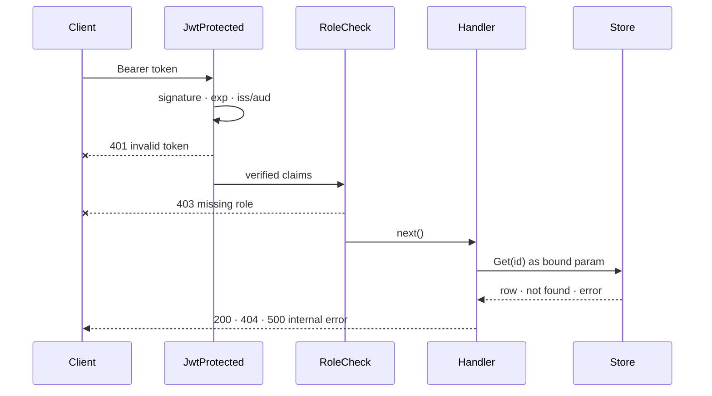

# HTTP API toolkit

Four packages that cover the usual plumbing of a JSON API built on
[Fiber v2](https://docs.gofiber.io/) and [GORM](https://gorm.io/).
{: .fs-6 .fw-300 }

  <a class="card" href="{{ '/api/generic-crud' | relative_url }}">
    
⚡

    
Generic CRUD

    
<code>api/generic</code> — list, get, create and delete routes for any GORM model, with paging, validation and safe errors.

  </a>
  <a class="card" href="{{ '/api/jwt-middleware' | relative_url }}">
    
🔐

    
JWT middleware

    
<code>api/middlewares</code> — Keycloak token verification, role checks and claim getters.

  </a>
  <a class="card" href="{{ '/api/http-client' | relative_url }}">
    
📡

    
HTTP client

    
<code>api/client</code> — a tiny resty wrapper for calling other JSON services with a bearer token.

  </a>
  <a class="card" href="{{ '/api/responses' | relative_url }}">
    
📦

    
Responses

    
<code>api/models</code> — the <code>OK</code> / <code>KO</code> envelopes every endpoint returns.

  </a>

## Request flow

Rejections (`--x`) stop the chain. Error details stay in the server log; the client only gets
the status and a generic message.
