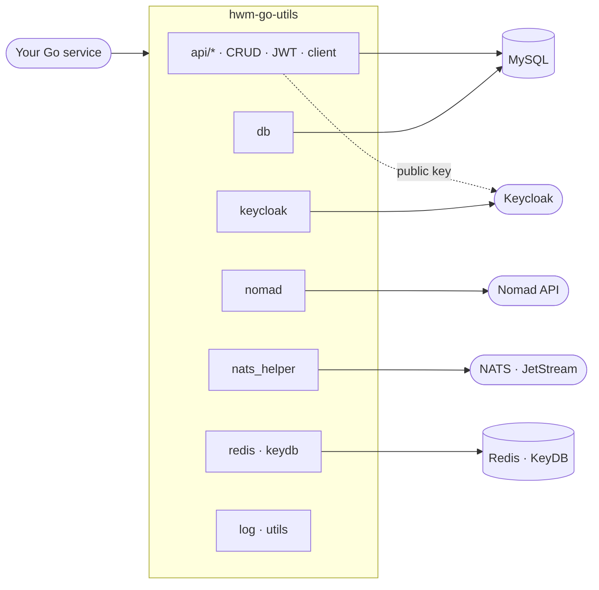

<div class="hero" markdown="1">

# Ship Go services faster, safely.
{: .fs-9 }

<p class="hero-tagline">
<strong>hwm-go-utils</strong> is the shared toolkit behind HiWay Media's Go services:
a CRUD REST API from a single struct, Keycloak JWT auth that fails closed, and
clients for Keycloak, Nomad, NATS, MySQL and Redis — hardened, tested, and
ready for production.
</p>

<div class="hero-install" markdown="1">

```shell
go get github.com/HiWay-Media/hwm-go-utils@latest
```

</div>

[Get started](getting-started){: .btn .btn-primary .fs-5 }
[Browse packages](#packages){: .btn .fs-5 }
[GitHub](https://github.com/HiWay-Media/hwm-go-utils){: .btn .fs-5 }

<div class="hero-badges">


</div>

</div>

## Why hwm-go-utils

<div class="cards">
  <a class="card" href="{{ '/api/generic-crud' | relative_url }}">
    <div class="card-icon">⚡</div>
    <p class="card-title">A REST API in one line</p>
    <p class="card-text"><code>SetEndpoints[Product]</code> wires list, get, create and delete routes on Fiber + GORM — paginated, validated, injection-safe.</p>
  </a>
  <a class="card" href="{{ '/api/jwt-middleware' | relative_url }}">
    <div class="card-icon">🔐</div>
    <p class="card-title">Auth that fails closed</p>
    <p class="card-text">Keycloak JWT verification with an RS-only allow-list, mandatory expiry, optional issuer/audience and role checks — no panics on odd tokens.</p>
  </a>
  <a class="card" href="{{ '/nats' | relative_url }}">
    <div class="card-icon">🛰️</div>
    <p class="card-title">Clients that survive outages</p>
    <p class="card-text">NATS reconnects forever, the Keycloak admin token refreshes itself, the Nomad client works with any base URL and ACL token.</p>
  </a>
  <a class="card" href="{{ '/security' | relative_url }}">
    <div class="card-icon">🛡️</div>
    <p class="card-title">Secure by default</p>
    <p class="card-text">No database errors or secrets in responses and logs, server-owned fields protected, dependencies kept free of known CVEs.</p>
  </a>
  <a class="card" href="{{ '/contributing' | relative_url }}">
    <div class="card-icon">🧪</div>
    <p class="card-title">Tested without infrastructure</p>
    <p class="card-text">Every fix ships with a regression test: GORM dry-runs, fake HTTP servers and signed test tokens — <code>go test -race</code> in CI.</p>
  </a>
  <a class="card" href="{{ '/utils' | relative_url }}">
    <div class="card-icon">🧰</div>
    <p class="card-title">Everyday helpers</p>
    <p class="card-text">Generic slice and map helpers, date maths, URL encoding, conversions and file utilities — small, dependency-free, documented.</p>
  </a>
</div>

## From zero to a protected REST API

One struct, one database, one line per resource:

```go
package main

import (
	"os"

	"github.com/HiWay-Media/hwm-go-utils/api/generic"
	"github.com/HiWay-Media/hwm-go-utils/api/middlewares"
	"github.com/HiWay-Media/hwm-go-utils/db"
	"github.com/HiWay-Media/hwm-go-utils/log"
	"github.com/gofiber/fiber/v2"
)

type Product struct {
	ID    uint    `json:"id" gorm:"primaryKey"`
	Name  string  `json:"name" validate:"nonzero"`
	Price float64 `json:"price"`
}

func main() {
	logger := log.GetLogger("info")

	database, err := db.Open("app", "secret", "mysql", 3306, "shop", "5", "20")
	if err != nil {
		logger.Fatalf("database: %v", err) // the error never contains the password
	}

	app := fiber.New()
	// realm public key from Keycloak → Realm settings → Keys → RS256 → Public key
	api := app.Group("/api", middlewares.JwtProtected(os.Getenv("KEYCLOAK_PUBLIC_KEY"),
		middlewares.WithIssuer("https://sso.example.com/realms/shop"),
	))

	// GET /api/products, GET /api/products/:id, POST /api/products, DELETE /api/products/:id
	generic.SetEndpoints[Product]("products", api, database, logger)

	logger.Fatal(app.Listen(":8080"))
}
```

[Walk through it step by step →](getting-started)

## How it fits together



## Packages

| Package | What you get | Guide |
|:--|:--|:--|
| `api/generic` | Generic CRUD handlers, service and store for any GORM model | [Generic CRUD](api/generic-crud) |
| `api/middlewares` | `JwtProtected`, `RoleCheck`, safe claim getters | [JWT middleware](api/jwt-middleware) |
| `api/client` | Minimal JSON REST client with bearer auth | [HTTP client](api/http-client) |
| `api/models` | Standard `OK` / `KO` response envelopes | [Responses](api/responses) |
| `keycloak` | Login, tokens, users, groups, realms, client roles | [Keycloak](keycloak) |
| `nomad` | Job definitions, allocations, scale, restart, run, delete | [Nomad](nomad) |
| `nats_helper` | Resilient NATS connection and JetStream context | [NATS](nats) |
| `db` | MySQL via GORM with pool limits | [Database](database) |
| `redis`, `keydb` | Cluster and single-node Redis clients | [Redis & KeyDB](redis) |
| `log` | zap console logger configured from a string | [Logging](logging) |
| `utils/*` | Strings, slices, maps, ints, dates, conversions, files | [Utilities](utils) |

{: .note }
Requires **Go 1.26 or later**. Upgrading from `v0.6.x`? Read the [upgrade guide](changelog) first — a few defaults changed for the better.
