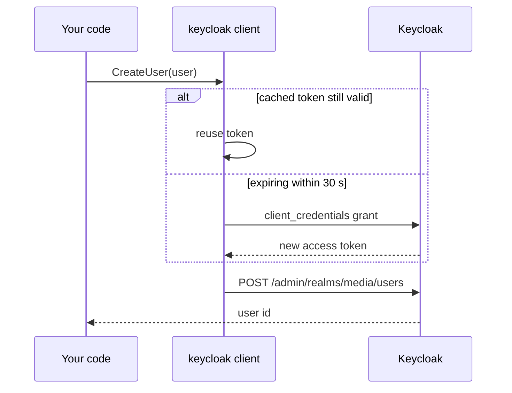

# Keycloak
{: .no_toc }

Authenticate users and administer Keycloak from Go, with an admin token that refreshes itself.
{: .fs-6 .fw-300 }

<dl class="glance">
  <dt>Import</dt><dd><code>github.com/HiWay-Media/hwm-go-utils/keycloak</code></dd>
  <dt>Built on</dt><dd><a href="https://github.com/Nerzal/gocloak">gocloak v10</a></dd>
  <dt>Auth</dt><dd>Confidential client (client id + secret) with a service account</dd>
</dl>

1. TOC
{:toc}

---

## Setup

```go
kc, err := keycloak.NewKeycloak(ctx,
	"media",                        // realm
	"https://sso.example.com",      // server URL
	os.Getenv("KEYCLOAK_CLIENT_ID"),
	os.Getenv("KEYCLOAK_CLIENT_SECRET"),
	false,                          // debug: log HTTP traffic
)
if err != nil {
	return err // wrong credentials or server unreachable
}
```

`NewKeycloak` immediately obtains a **client-credentials** token, so bad configuration fails
at startup instead of on the first request.

### Keycloak client configuration

1. Create a client with *Client authentication* **on** (confidential).
2. Enable **Service accounts roles**.
3. In *Service account roles*, assign the `realm-management` roles your code needs
   (`manage-users`, `view-users`, `manage-realm`, …).
4. Enable **Direct access grants** if you call `Login` with username and password.

## The admin token

Admin methods (users, groups, realms, roles) use the service-account token, which the client:

- caches in memory;
- refreshes automatically **30 seconds before it expires**;
- protects with a mutex, so concurrent requests trigger a single refresh.

You never handle it yourself.



## End-user sessions

| Method | Purpose |
|:--|:--|
| `Login(username, password)` | Password grant for the configured client → `*gocloak.JWT` |
| `RefreshToken(refreshToken)` | New access token from a refresh token |
| `Logout(refreshToken)` | End the session behind a refresh token |
| `GetToken(opts)` | Any grant, with full `gocloak.TokenOptions` control |

```go
jwt, err := kc.Login("jane@example.com", password)
if err != nil {
	return fiber.ErrUnauthorized
}
return c.JSON(fiber.Map{"access_token": jwt.AccessToken, "refresh_token": jwt.RefreshToken})
```

## Users and groups

| Method | Purpose |
|:--|:--|
| `CreateUser(user)` | Create a user, returns its id |
| `GetUserEmail(email)` | First user with that email; error if none |
| `UpdateUser(first, last, email, attributes, realmRoles)` | Update the user found by `email` |
| `SetPassword(userID, realm, password, temporary)` | Set a password; empty `realm` means the client's realm |
| `LogoutUserSession(sessionID)` | Kill one session |
| `CreateGroup(group)` | Create a group, returns its id |
| `AddClientRoleToUser(clientUUID, userID, roles)` | Grant client roles |

```go
id, err := kc.CreateUser(gocloak.User{
	Username: gocloak.StringP("jane@example.com"),
	Email:    gocloak.StringP("jane@example.com"),
	Enabled:  gocloak.BoolP(true),
})
if err != nil {
	return err
}
return kc.SetPassword(id, "", initialPassword, true) // user must change it at first login
```

## Realms

| Method | Purpose |
|:--|:--|
| `GetRealms()` / `GetRealm(name)` | Read realm representations |
| `CreateRealm(rep)` / `UpdateRealm(rep)` / `DeleteRealm(name)` | Manage realms (needs `manage-realm` on the master realm) |

## Testing

Unit tests run against a fake token endpoint (`httptest`). The integration tests
`TestAPI` and `TestIKeycloak` run only when `KEYCLOAK_SERVER`, `KEYCLOAK_REALM`,
`KEYCLOAK_CLIENT_ID` and `KEYCLOAK_CLIENT_SECRET` are set, and are skipped otherwise.
