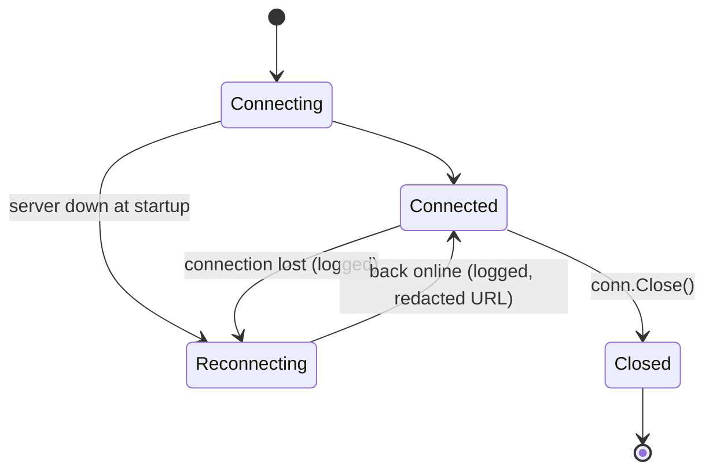

# NATS
{: .no_toc }

A NATS connection tuned for long-running services: it keeps reconnecting for as long as the
server is away, and logs every state change.
{: .fs-6 .fw-300 }

<dl class="glance">
  <dt>Import</dt><dd><code>github.com/HiWay-Media/hwm-go-utils/nats_helper</code></dd>
  <dt>Built on</dt><dd><a href="https://github.com/nats-io/nats.go">nats.go</a> + <code>jetstream</code></dd>
</dl>

## Usage

```go
conn, err := nats_helper.NewNatsConn("nats://nats-1:4222,nats://nats-2:4222", logger)
if err != nil {
	return err
}
defer conn.Close()

// publish / subscribe with automatic JSON encoding
if err := conn.Publish("events.match.started", MatchStarted{ID: 42}); err != nil {
	return err
}
_, err = conn.Subscribe("events.match.*", func(ev *MatchStarted) {
	logger.Infof("match %d started", ev.ID)
})

// JetStream (streams, consumers, key-value, object store)
js, err := nats_helper.NewNatsJetStream(conn, logger)
if err != nil {
	return err
}
stream, err := js.Stream(ctx, "EVENTS")
```

## Connection behaviour

| Setting | Value | Why |
|:--|:--|:--|
| `RetryOnFailedConnect` | `true` | The service starts even if NATS is not up yet |
| `MaxReconnects` | `-1` (unlimited) | The default of 60 attempts would close the connection **for good** after about a minute of downtime |
| `ReconnectWait` | 1 s | |
| `PingInterval` | 30 s | Detects dead TCP connections |
| Encoder | JSON | `Publish` / `Subscribe` marshal Go values |



Disconnections are logged at error level with the reason, reconnections at info level with
the server URL (credentials redacted), and a final close at error level.

{: .note }
The connection is a `*nats.EncodedConn`, which nats.go has deprecated. It still works; moving
to a plain `*nats.Conn` is planned for a future release because it changes the API.
